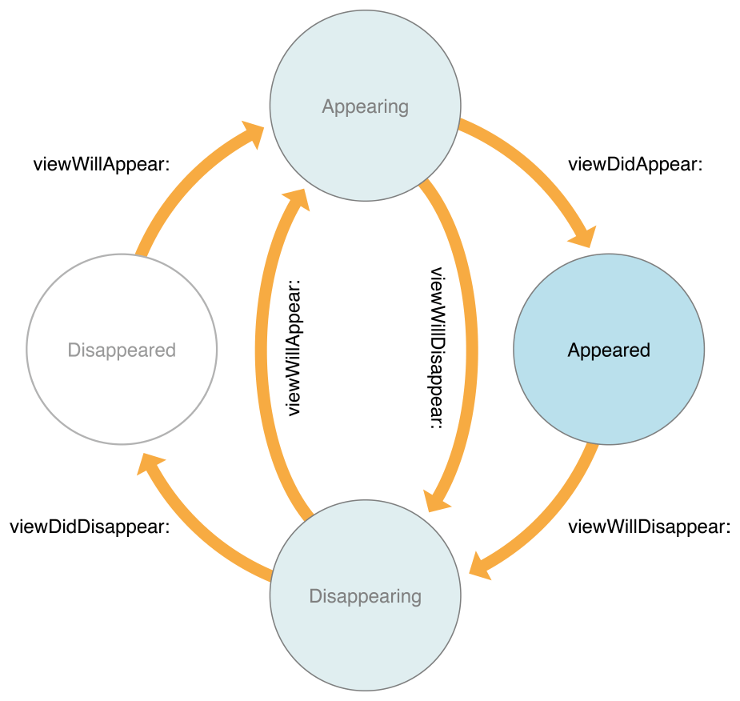
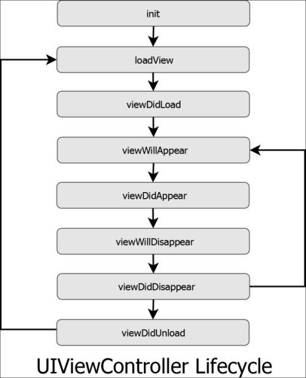
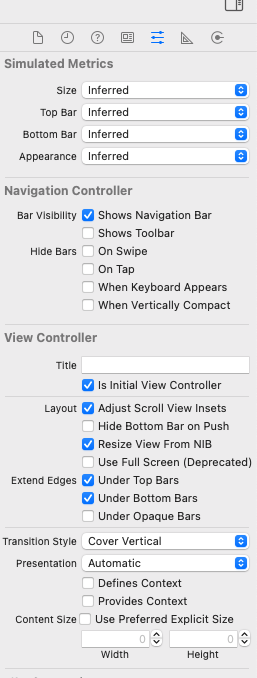
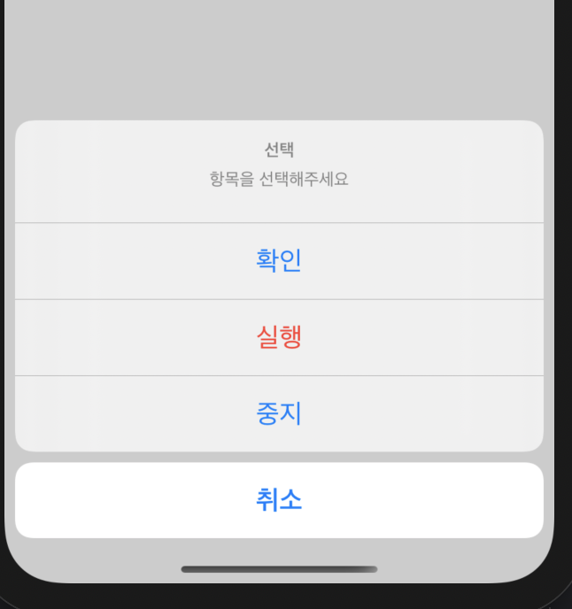

#  IOS 공부 정리

> 고자료 
>
> - 꼼꼼한 재은씨의 Swift 기본편, 실전편
> - https://zeddios.tistory.com/

## 1. 스위프트UI vs 스토리보드

<details>
<summary>자세히</summary>
	<div markdown="1">

1. xcode 11버전에선 이른바 SWIFT UI란 이름으로 새로운 방식의 디자인 인터페이스를 제공한다. 애플은 오랫동안 스토리보드 혹은 프로그래밍적으로 짤 수 있는 UI 방법 두 가지를 제공했다. SWIFT UI는 이 방식을 탈피하여, 나눠지는(쪼개지는) 화면 경험을 제공한다.

- 어떻게 레이아웃이 보이고 작동하는지에 대한 새로운 UI

- 실시간으로 Swift 코드 작성시 UI 미리보기를 제공함

2. #### UIKit -> SwiftUI

> Swift UI는 말 그대로 UI관련 프레임워크다. 그러므로 기존에 사용하고있던, 각각의 뷰 컨트롤러 클래스에 거의 들어가있던
>
> ```
> import UIKit
> ```
>
> 이 부분을
>
> ```
> import SwiftUI
> ```
>
> 로 바뀐다는 것을 의미한다. 그러므로 SwiftUI를 Import하게 될 경우 UI가 앞에 붙었던 애들이 다 탈락하고 새롭게 변한다.

3. 아직은 UIkit 즉 스토리보드가 많이 사용되는 추세이나 곧 SwiftUI로 넘어갈 것 같다.-> SwiftUI로 배우는게 더 나을 수도 있음. 하지만 이전버전을 고쳐야하기 때문에 둘다하기에는 많이 힘들다.

</div>
</details>

## 2. 뷰 컨트롤러의 상태 변화와 생명주기

<details>
<summary>자세히</summary>
	<div markdown="1">



> 뷰 컨트롤러의 생명주기는 다음과 같이 나눌 수 있다. 

- Appearing: 뷰 컨트롤러가 스크린에 등장하기 시작한 순간부터 등장을 완료하기 직전까지의 상태, 다른 뷰 컨트롤러와 교차되기도함 
- Appeared : 뷰 컨트로럴가 완전히 등장한 상태
- Disappearing : 뷰 컨트롤러가 스크린에서 가려지기 시작해서 완전히 가려지기 직전의 상태, 또는 퇴장하기 시작해서 완전히 퇴장한 상태, 새로 등장하는 뷰 컨트롤러와 교차
- Disappeared : 뷰 컨트롤러가 스크린에서 완전히 가려졌거나 혹은 퇴장한 상태를 의미한다. 

### 중요 뷰 컨트롤러 함수들

- `viewWillAppear()`: 화면이 다시 등장하기 시작한상태(=Appearing)로 바뀌는 동안 뷰 컨트럴러는 앱 객체에 의해 이 메서드를 호출하고 주로

**화면이 등장할 때 마다 데이터를 갱신 해주고 싶다면 이 메소드를 override 해서 원하는 코드를 작성한다.**

- `ViewDidAppear` - 뷰 컨트롤러가 화면에 나타난 직후에 실행됩니다. 화면에 적용될 애니메이션을 그리거나 **API로 부터 정보를 받아와 화면을 업데이트 할 때 이곳에 로직을 위치시키면 좋습니다**. 왜냐하면 지나치게 빨리 애니메이션을 그리거나 API에서 정보를 받아와 뷰 컨트롤러를 업데이트 할 경우 화면에 반영되지 않습니다.
- `viewDidDisappear` - 뷰 컨트롤러가 화면에 나타난 직후에 실행된다.


</div>
</details> 

## 3.  테이블 뷰를 이용한 데이터 목록구현
<details>
<summary>자세히</summary>
	<div markdown="1">

- 내비게이션 컨트롤러를 선택하면 테이블 뷰 컨트롤러가 덤으로 추가된다.

- 테이블 뷰 오브젝트를 선택하고 [Editor] -> [Embed In] -> [Navigation Contoller] 방식으로 추가해도되지만 네비게이션 컨트롤러를 선택하면 TableView가 자동으로 따라온다.
- 주의할점! 처음에 설정된 뷰 컨트롤러를 삭제하면 initial View Controller를 반드시 지정해줘야한다. 

{: width="100" height="100"}

- ListViewController.swift 

> 네비게이션 바에서 +를 클릭했을때 알람창이 뜨고 거기서 추가될 글을 작성할 수 있도록 만들고 싶다. 다음과 같이 구현

```swift
//
//  ListViewController.swift
//  Table-CellHeight
//
//  Created by 염성훈 on 2021/04/03.
//

import UIKit

class ListViewController : UITableViewController {
    // 테이블 뷰에 연결될 빈 배열을 정의해준다.
    var list = [String]()
    
    @IBAction func add(_ sender: Any) {
        
        let alert = UIAlertController(title: "목록 입력", message: "추가될 글을 작성해주세요.", preferredStyle: .alert)
        
        // 알림창에 입력 폼을 출력한다.
        alert.addTextField() { (tf) in
            tf.placeholder = "내용을 입력하세요"
        }
        // ok버튼 객체 생성
        let ok = UIAlertAction(title: "OK", style: .default){(_) in
            // 배열에 입력된 값을 추가 하고 테이블 갱신
            if let title = alert.textFields?[0].text {
                self.list.append(title)
                self.tableView.reloadData()
            }
        }
        
        
        // cancel 객체 생성
        let cancel = UIAlertAction(title: "취소", style: .cancel, handler: nil)
        
        // 알림창 객체에 버튼 객체를 등록한다.
        alert.addAction(ok)
        alert.addAction(cancel)
        
        self.present(alert, animated: false)
    }
    
    override func tableView(_ tableView: UITableView, numberOfRowsInSection section: Int) -> Int {
        return self.list.count
    }
    
    // 셀 안의 내용을 넣어주는 함수이다.
    override func tableView(_ tableView: UITableView, cellForRowAt indexPath: IndexPath) -> UITableViewCell {
        // "cell" 아이디를 가진 셀을 읽어온다. 없으면 UITableViewCell 인스턴스를 생성한다.
        // cell 아이디를 가진 셀을 읽어와 옵셔널 해제! 근대 그값이 nil 이면 UITaleVIewCell 인스턴스를 새로 생성해!
        let cell = tableView.dequeueReusableCell(withIdentifier: "cell") ?? UITableViewCell()
        cell.textLabel?.text = list[indexPath.row]
        
        // 셀의 기본 텍스트 레이블 행 수 제한을 없앤다. 별도로 속성을 지정해주지 않으면 글자가 아무리 길어도 한줄로만 표현된다. 0으로 하면 글자 길이에 따라 높이가 자동으로 늘어남
        cell.textLabel?.numberOfLines = 0
        
        return cell
    }
    
    // 셀 높이를 조절해줄 메소드 가로 행에 대한 정보를 인자 값으로 받고, 그 행의 높이를 얼마로 계산하여 반환해 줄지 정한다.
    override func tableView(_ tableView: UITableView, heightForRowAt indexPath: IndexPath) -> CGFloat {
        let row = self.list[indexPath.row]
        // 높이를 조절해 준다.
        let height = CGFloat(60 + (row.count / 30) * 20) // CGFloat는 메소드 반환 타입을 일치시켜줄 목적으로 사용한 객체이다.
        
        return height
    }   
}

```

- `UIAlertController` 객체를 먼저 형성해준다. 3번째 값이 알람창의 스타일을 결정하는 항목이다. `actionSheet` 와 `alert` 로 선택할 수 있다.
- `actionSheet`는 알림창 내부에 입력 필드를 넣을 경우 사용할 수 없다.
- `addTextField`은 입력 폼을 추가 하는 메소드를 추가한다. 클로저에 대한 이해 가 필요

- 알림창에 연결될 버튼 객체를 형성해줘야한다. 세 번째 인자 값을 사용하여 버튼 클릭에 대한 액션을 정의해 줄 수있다.

### 후행클로저

```swift
  let ok = UIAlertAction(title: "OK", style: .default){(_) in
            // 배열에 입력된 값을 추가 하고 테이블 갱신
            if let title =  alert.textFields?[0].text {
                self.list.append(title)
                self.tableView.reloadData()
            }
        }
```

- 이부분이 후행클로저 인데  `UIAlertAction` 클래스의 세번쨰 인자값을 사용하면 클릭했을때의 어떤 행동을 할지에 대한 것을 정의해 줄 수 있다. 

  저 부분이 이해가 안갔었는데 3번째 인자에 함수를 넣어 기능을 동작하게 해야하는데 저렇게 빼서 클로저 형식으로 넣어도 된다.


### Nil-Coalescing Operatior

- A ?? B

> 만약 A가 nil이 아닐 경우 옵셔널을 해제하고, nil일 경우 대신 B값을 사용하라는 말이다. 

```swift
override func tableView(_ tableView: UITableView, cellForRowAt indexPath: IndexPath) -> UITableViewCell {
        // "cell" 아이디를 가진 셀을 읽어온다. 없으면 UITableViewCell 인스턴스를 생성한다.
        // cell 아이디를 가진 셀을 읽어와 옵셔널 해제! 근대 그값이 nildㅣ면 UITaleVIewCell 인스턴스를 새로 생성해!
        let cell = tableView.dequeueReusableCell(withIdentifier: "cell") ?? UITableViewCell()
        cell.textLabel?.text = list[indexPath.row]
        return cell
        }
```

### 셀프 사이징 직접 높이값을 계산해서 맞추지 않아도 콘텐츠에 따라 자동으로 동적으로 높이를 결정해주는 것

```swift
  override func viewWillAppear(_ animated: Bool) {
        self.tableView.estimatedRowHeight = 50 // 대충의 높이값
        self.tableView.rowHeight = UITableView.automaticDimension
    }
```

- `viewWillAppear` :  뷰가 나타나기 직전에 호출된다. `viewDidload`랑은 다른 점이 있는데 앱의 완전한 초기화 작업은 `viewDidLoad`에서 처리해도 되지만 다른 뷰에서 갔다가 다시 돌아오는 상황에서는 viewWillAppear에서 해주면된다.

</div>
</details>

## 4. 일반 뷰 컨트롤러에서 테이블 뷰 사용하기

<details>
<summary>자세히</summary>
	<div markdown="1">

> 테이블 뷰 컨트롤러를 사용하게 되면 검색바 등의 UI를 단순히 테이블 뷰 위아래 추가하는 건 가능하지만 여러가지 뷰로 구서오디는 화면을 제작해야할 떄는 충분히 구현하기 어렵다. 따라서 일반 뷰 컨트롤러에서 테이블 뷰를 직접 구현하는 경우가 더욱 많다.

- 익스텐션 분리하기 : 델리게이트를 사용할때 같은 파일에서 extension을 쓰면 하나의 코드에서 작성하지 않고 델리게이트별, 메소드별로 코드를 구성할 수 있다.

```swift
// 테이블을 구성하기 위해 필요한 메소드를 정의한다.
extension ViewController: UITableViewDataSource {
    func tableView(_ tableView: UITableView, numberOfRowsInSection section: Int) -> Int {
        return 5
    }
    
    func tableView(_ tableView: UITableView, cellForRowAt indexPath: IndexPath) -> UITableViewCell {
        let cell = tableView.dequeueReusableCell(withIdentifier: "cell")!
        
        cell.textLabel?.text = "\(indexPath.row)번째 데이터 입니다."
        
        return cell
    }
    
}
// 테이블에서 발생하는 액션/이벤트와 관련된 메소드를 정의한다.
extension ViewController: UITableViewDelegate {
    func tableView(_ tableView: UITableView, didSelectRowAt indexPath: IndexPath) {
        NSLog("\(indexPath.row)번째 데이터가 클릭됨.")
    }
}

```

- 테이블 뷰 컨트롤러와의 차이점이 있는데 `override ` 가 없다는 것이다. 프로토콜에 대한 메소드를 직접 구현하는 것이기 때문에 재정의가 아니다.

- **반드시!!! 테이블 뷰를 상단 뷰 컨트롤러 아이콘으로 드래그해서 [dataSourced] 와 [delegate]에 연결해줘야한다.**

  - 델리게이트를 사용하는 객체가 추가되면 이들 객체가 필요한 메소드를 어디서 찾을 수 있는지에 대한 정보를 알려줘야하기 떄문이다.

  `self.tabeView.dataSource = self`, `self.tableView.delegate=self` 와 동일하다. 


</div>
</details>


## 5. 델리게이트 패턴(중요!)

<details>
<summary>자세히</summary>
	<div markdown="1">

> 위임자를 정한다는 의미이다. 

- 도대체 이게 무슨 소리인지 이해가가지 않았는데 결론은 `어떤 객체에 이벤트가 발생하면 내가 대신 처리할께` 라는 의미로 받아 들이면된다. 

- `textField.delegate=self` 여기서 self는 현재 클래스인 `ViewController`이다.

  즉 textField에 이벤트가 발생하면 `ViewController`에서 프로토콜에 따라 응답을 해준다는 의미이다.

```swift
// 프로토콜을 채택하는 작업을 한다. 
class ViewController: UIViewController, UITextFieldDelegate {

override func viewDidLoad() {
  super.viewDidLoad()
  textField.delegate = self
}
}
```

- `textFieldShouldReturn` 함수는 `UITextFieldDelegate` 안에 정의되어 있는 함수이다.
- 즉 이 동작을 **대신** 해줄 함수를 불러와 그 함수안에 우리가 하고 싶은 일을 **'구현'** 하면 된다. 

```swif
func textFieldShouldReturn(_ textField: UITextField) -> Bool {

        enteredLabel.text = textField.text

        return true

    }
```

</div>
</details>


## 6. 사용자에게 메세지를 전달하는 방법

> 3가지 방법이 있음 1) 메시지창(알림창) 2)로컬 알림 3) 서버 알림(푸시 알림)

- 메시지창은 앱이 실행 중일 때만 동작하기 때문에 로컬 알림, 서버 알림이 필요하다.

- 로컬 푸시 : 앱 내부에서 특정 프로세스에 의해 등록된 메세지를 iOS가 전달하는 방식

- 서버 푸시 : 별도의 서버를 통해 APNs라는 애플 고유의 메시징 시스템에게 보낸 메세지가 네트워크를 통해 전달되는 방식

  - 서버 푸시는 앱 서비스 운영자가 필요한 시점에 인스턴스 메시지를 만들어 날릴 수 있다. 로컬 푸시는 앱을 제작할때 앱 내부 코드에 심어 놓은 메시지가 전달되서 한계가 있을 수 있음. 

  - 별도의 서버가 필요하기 떄문에 서버가 필요하다.

### 6.1 메세지 알림창 - UIAlertController

> 메시지 창을 구현하는 객체는 UIAlertController이다.

- 두가지 형태가 있다. 하나는 알림창, 다른 하나는 액션시트이다.

1) 알림창 - 모달 방식으로 창이 닫힐 때까지 화면의 다른 부분은 반응할 수 없도록 잠긴다. 

2) 액션시트 - 메시지가 떠 있는 동안에도 메세지 창이 아닌 다른 영역을 건드릴 수 있으며, 그 결과로 액션 시트 창이 닫힌다. 

- UIAlertController에는 사용자가 원하는 대로 버튼을 추가할 수 있다. 버튼은 `UIAlertAction` 객체에 의해서 구현되는데, 필요한 버튼 수만큼 UIAlertAction 객체를 구현하고, 이 버튼이 클릭 되었을 때 실행해줄 코드를 인자 값으로 넣어 초기화 하면 된다. 

- `UIAlertController`는 하나의 뷰 컨트롤러 이기 떄문에, 실행 역시 뷰 컨트롤러에 의한 화면 이동 방식을 사용해야한다. 즉. 또 다른 하나의 화면이라고 생각하고 화면을 전환시켜 주어야한다.단, 버튼이 클릭되면 창은 자동으로 닫히기 떄문에 `dismiss(animated:)` 메소드를 구현해 줄 필요는 없다.

- 캔슬 타입의 버튼은 액션시트창에서 한번 밖에 쓸수가 없다.

  > 아래와 같이 딱 한개의 요소만 cancel창에서 분리되기 때문이다. 

```swift
let cancel = UIAlertAction(title: "취소", style: .cancel) // 취소 버튼
```




- 화면이 뜨자마자 자동으로 메시지 창을 띄워주어 할 때? 네트워크 기반 서비스에서 네트워크가 연결 되지 않았을때? 어떻게 창을 띄워줘야하나??

  > `viewDidLoad()` 내에서 메시지 창을 구현하려면 런타임 오류가 발생한다. **왜?? 아직 메시지 창을 처리해 줄 뷰가 화면에 구현되지 않은 상태에서 화면 전환을 시도했기 때문!!**

  - `viewDidAppear()` 메소드를 사용해서 메시지 창을 처리해준다. 왜??? 뷰가 완전히 화면에 표현되고 호출되기 떄문에 프레젠트 메소드를 실행하는데 아무런 문제가 없다. 

- 알람창에 텍스트 필드의 속성을 설정하고 싶을 때는 아래와 같은 클로저 문법을 사용시켜준다.

```swift
alert.addTextField(configurationHandler: { (tf) in
            tf.placeholder = "암호" //안내 메세지
            tf.isSecureTextEntry = true // 비밀번호처리
        })
```

- 확인 버튼을 클릭후 실행하는 함수를 지정해 줄 수 있다. 

> textField의 수는 여러개 이기 때문에 textfields속성 타입이 배열로 이뤄져 있다. 따라서 첫번째 텍스트필드를 참조하려면 인덱스 0번을 통해 배열의 첫번째 인자를 읽어 들여야한다.

```swift
 let ok = UIAlertAction(title: "로그인", style: .default){(_) in
            if let tf = alert.textFields?[0] {
                print("입력된 값은 \( tf.text!)입니다.")
            } else {
                print("입력된 값이 없습니다.")
            }
        }	
```

- 텍스트 필드(인풋창) 이 여러개 일 경우 아래와 같이 지정한다.

```swift
let loginId = alert.textFields?[0].text
            let loginPw = alert.textFields?[1].text // 두번째 텍스트 필드이기 떄문에 두번째 배열로 지정한다.
```


### 6.2 로컬 알림 - UserNotification(IOS 10버전 이상부터)

> 앱 내부에서 만든 특정 메시지를 iOS의 알림 센터를 통해 전달하는 방법이다. **앱이 종료 되어 있거나 백그라운드 상태일때 베시지를 전달 할 수 있다.**

- `UserNotification ` 은 UIKit 프레임 워크와 독립된 프레임워크 이다. 따라서 객체를 사용하려면 파일 상단에 반입 구문을 추가해줘야한다.

```swift
import UserNotification
```

- `UNMutableNotificationContent` : 로컬 알림 타이틀, 서브 타이틀 및 알림 메시지를 설정할 수 있음. 앱 아이콘에 표시될 배지나 사운드 설정 또한 가능
- `UNTimeIntervalNotificationTrigger`: 알림 발송 조건 관리, 발생 시각과 반복여부

- `UNNotificationRequest`: 위의 두가지 객체와 알림 발송 조건 객체를 인자 값으로 하여 그 결과로 알림 요청 객체가 생성되게 된다. 
  - `UNUserNotificationCenter`: 발송을 담당하는 센터, 이 객체는 싱글턴 방식으로 동작한다. -> 다로 인스턴스를 생성하지 않고 current() 메소드를 통해 참조 정보만 가져올 수 있다. 